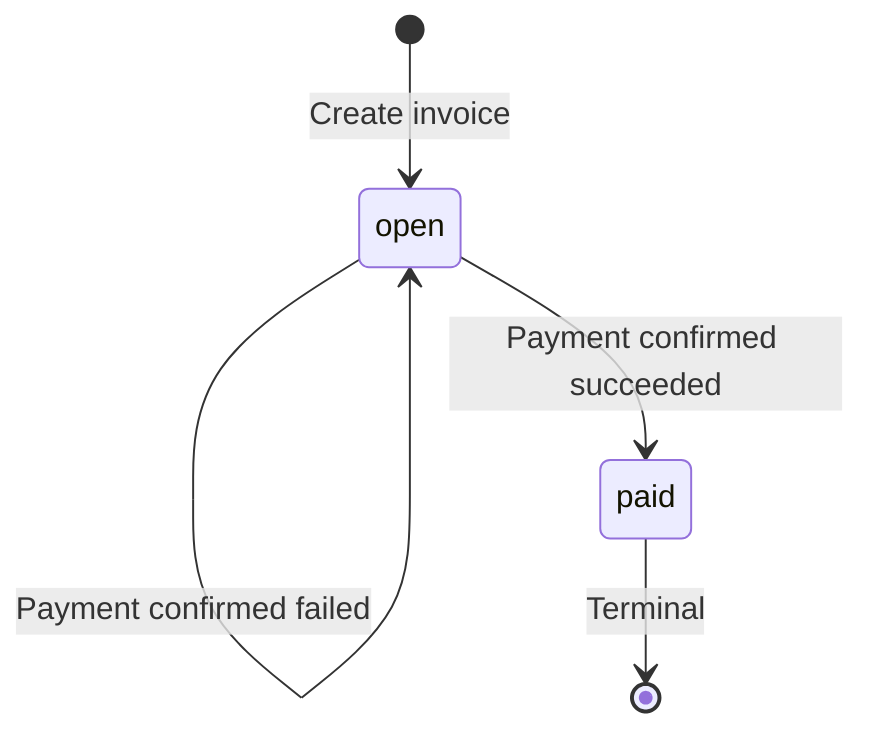
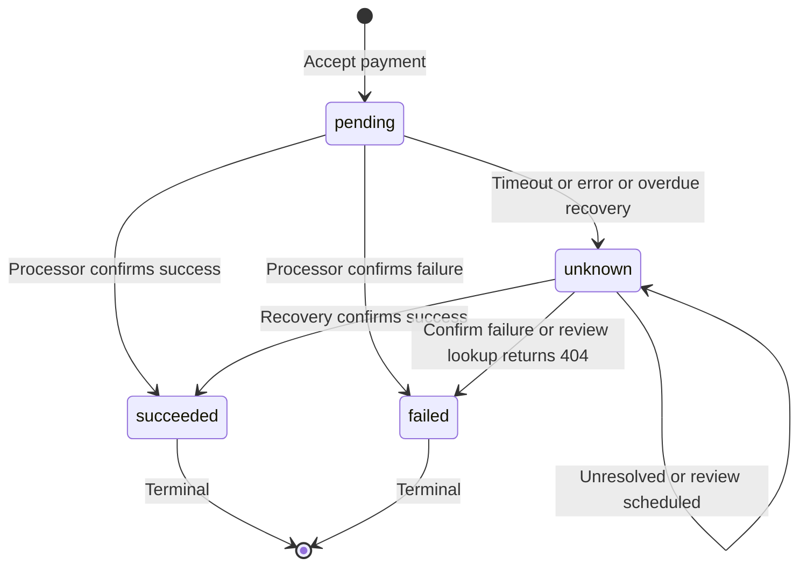

# Invoice and Payment Service

I chose Java and Spring Boot for familiarity. The modular monolith uses Java interfaces and separate PostgreSQL schemas. Invoice, payment and event changes commit together. HTTP connects processors and webhook receivers.

## 1. Data Model

Businesses own customers and invoices. Invoices have items and attempts. Events produce endpoint deliveries.

Unless stated otherwise, primary keys are PostgreSQL-generated UUIDv7 `id` values, improving index locality over random UUIDs. Queries use authenticated `business_id`. Composite foreign keys enforce tenant-consistent invoice/customer, attempt/invoice and delivery/event/endpoint links.

Tenant means `business_id`. List indexes end with descending `created_at, id`. Uniqueness creates indexes.

| Table | Main fields and indexes | Reason for shape | At 100x |
|---|---|---|---|
| `identity.businesses` | Name, creation time. Primary key only. | Avoid repeated tenant details. | Keep small. |
| `identity.api_keys` | Tenant, prefix, hash, revoked time. Unique prefix. | Allow overlapping keys during rotation. | Cache only with reliable revocation. |
| `customers.customers` | Tenant, name, email. Unique tenant/ID. Tenant list index. | Reuse customer details across invoices. | Scale list reads. |
| `billing.invoices` | Tenant, customer, state, USD total, due date, paid time. Unique tenant/ID. Tenant and tenant/state list indexes. | Preserve the issued total. | Separate reporting reads. |
| `billing.invoice_items` | Invoice, position, description, quantity, unit cents. Unique invoice/position. | Rows enforce ordering and limits. | Archive with invoices. |
| `payments.payment_attempts` | Tenant, invoice, key, fingerprint, token, amount, outcome, lease, version, counters, deadlines. Unique tenant/key and tenant/ID. Invoice list index. Partial unique unresolved/successful indexes per invoice. Partial due index excludes review rows. | Restartable work and attempt history. | Index review scheduling. Preserve deduplication when archiving. |
| `notifications.events` | Tenant, type, source, invoice, JSON data as text. Unique tenant/type/source and tenant/ID. Tenant list and tenant/invoice indexes. | Stored snapshots survive receiver downtime. | Archive older events. |
| `notifications.webhook_endpoints` | Tenant, URL, encrypted secret, active flag. Unique tenant/ID. Tenant index. Unique active tenant/URL. | Separate configuration from delivery history. | Bound endpoints per tenant. |
| `notifications.webhook_deliveries` | Tenant, event, endpoint, invoice, type, status, count, lease, version, HTTP result, deadline. Unique event/endpoint. Tenant and tenant/invoice list indexes. Partial pending-due index. | Independent retries per destination. | Archive finished rows. Limit endpoint concurrency. |
| `mock_psp.operations` | PK is supplied attempt UUID. Fingerprint, amount, currency, token, outcome, completion time, POST count. Partial pending-completion index. | Durable deduplication replaces process memory. | Preserve IDs throughout retries. |
| `demo_receiver.received_events` | PK is supplied event UUID. Type, payload, receipt time. Receipt-time index. | Uniqueness deduplicates receipt. | Retain deduplication beyond replay windows. |

Liquibase tracks migrations. Modules share one app role. Processor and receiver roles are separate.

Money uses `long` and `bigint` cents. Checked arithmetic rejects overflow. Only the server calculates totals, bounded from 1 to 10^12 cents.

At 100x, measure database load, queues and lock waits. Scale APIs and workers independently. Partitioning must preserve uniqueness. Capacity is unproven.

## 2. Invoice State Machine

`open` means unpaid. Pending or unknown attempts block payment. Failure permits another attempt. Due dates cause no transition. `paid` is irreversible. Self-loops preserve state.

`review_required` flags unknown attempts. Terminal outcomes cannot reverse. Retries never restore pending.

`PaymentService.accept` checks eligibility under the invoice lock. Invalid requests return `409 payment_in_progress` or `409 invoice_already_paid`. There is no arbitrary state-update API. Finalization checks unresolved status and claim version. Database checks restrict states and completion timestamps.

## 3. Payment Correctness & Failure Modes

Payment requests use `POST /api/v1/invoices/{id}/pay`.

PostgreSQL row-level locks through JPA `PESSIMISTIC_WRITE` coordinate replicas; unique constraints provide backup. In-memory locks cannot coordinate replicas. Advisory locks add conventions. Optimistic locking and serializable isolation add retries. HTTP runs outside transactions.

### (a) Simultaneous payment requests

Different keys serialize on the invoice lock. One saves pending work and returns 202. The other gets 409 while that work remains unresolved or after success. If failure finishes before the second locks, another attempt is allowed. Same-key identical requests return 202 but share one attempt. Cross-invoice key races hit unique tenant/key; the loser rolls back and rereads the key.

### (b) Processor timeout

Acceptance saves pending work and returns 202 with `payment_attempt_id` and `status_url`. The worker uses a 5-second read timeout and 1-second connection timeout. Timeout changes the attempt to unknown. The invoice stays open but blocked.

Lookup retries follow delays of 5, 10, 20, 40, 60 and 120 seconds. The mock completes after 30 seconds; a later lookup marks the attempt succeeded and invoice paid. Poll `status_url` with the API key or receive `invoice.paid`.

After six recovery rounds or ten minutes, unresolved work gets `review_required` and checks every 15 minutes. Previously claimed attempts only look up during review; a 404 becomes failed. Never-claimed attempts may make their first POST. This depends on mock lookup; real providers may have ambiguous absence.

### (c) Crash after processor success

The attempt commits before the processor call. After lease expiry at 60 seconds, another worker claims and looks up the same attempt UUID. Stored success settles it without another charge. Client retries with the original key replay acceptance.

Before review mode, lookup 404 permits a POST with the same operation ID. The mock deduplicates that ID. Claim versions reject stale workers' database writes. Attempt outcome, invoice state and webhook records commit together or all roll back. Duplicate-charge protection depends on durable processor deduplication, not the invoice lock alone.

### (d) Key reused with different body

SHA-256 fingerprints the payment operation, invoice ID and parsed token. A changed valid request returns `409 idempotency_key_conflict`. Whitespace does not change meaning. Keys are business-scoped and only accepted requests reserve them.

### (e) Paying a paid invoice

An unused key gets `409 invoice_already_paid`. The original key and body replay the original 202 body, including pending status, without calling the processor. Polling gives the current outcome. A conflicting existing key gets the key-conflict error.

`tok_network_error` returns 500, initially meaning unknown. The mock stores `processor_error`; lookup confirms failure and releases the payment block. A 500 alone never proves failure. Lookup and durable deduplication are explicit mock extensions.

## 4. Webhook Design

`WebhookEvents.record` saves `invoice.created`, `invoice.paid` or `invoice.payment_failed` and delivery rows with the business transaction. This outbox preserves committed events. Workers use `SKIP LOCKED`, 30-second leases and claim versions. Sending after commit keeps receiver downtime off the API response path.

HMAC-SHA256 signs `timestamp + "." + exact UTF-8 body`. Headers include `X-Webhook-Timestamp`, `X-Webhook-Id` and `X-Webhook-Signature: v1=<hex>`. Retries get fresh signatures. Receivers compare signatures in constant time, reject timestamps outside 300 seconds either way, check the signed event ID and deduplicate it.

Six attempts are allowed: immediate, then 5, 30, 120, 600 and 1800 seconds after failures. Waits total 42 minutes 35 seconds, excluding execution and scheduling. Read timeout is 5 seconds; connection timeout 1 second. A one-hour deadline stops new sends. Claims consume attempts even if workers crash before sending. Non-2xx and transport failures retry.

Exhausted rows remain at `/api/v1/webhook-deliveries`. Businesses page through `/api/v1/events`, deduplicate IDs and fetch invoices to reconcile. Creation-time pagination is not a gap-free stream. There is no replay API. Delivery can repeat or arrive unordered.

32-byte signing secrets are returned once, encrypted with AES-GCM using an external key. HTTPS destinations are checked before registration and delivery; trusted demo hosts may use HTTP. Redirects are disabled. DNS checks do not pin connection addresses.

## 5. API Key Model

Keys combine a random 12-byte prefix and 32-byte secret as `prefix.secret`. Store the prefix, SHA-256 secret hash, tenant and revocation time, never the full key. High entropy justifies fast hashing. Requests check revocation and compare hashes in constant time.

Transmit through `Authorization: Bearer` over production HTTPS. CLI prints keys once. Rotate by creating another, switching clients and revoking the old key. Authenticated work may finish. A leak grants all supported business actions; narrower scopes are absent.

## 6. What I Cut and Why

- Draft, void and uncollectible states lack required workflows.
- Refunds and partial payments need additional accounting rules.
- Subscriptions, taxes and currencies beyond USD exceed scope.
- Internal HTTP and sagas were considered, then dropped to preserve local atomicity.
- Webhook replay and in-place secret rotation need separate controls.

Optional UI exceeds scope.

## 7. Production Readiness Gap

1. Real processor integration. Define idempotency retention, ambiguous lookup handling and settlement reconciliation before accepting real money.
2. Security and capacity controls. Add managed secrets, TLS, rate limits, controlled webhook egress and load testing.
3. Operations. Export existing traces, alert on old queues and review flags, and add an operator audit trail and recovery procedures.
