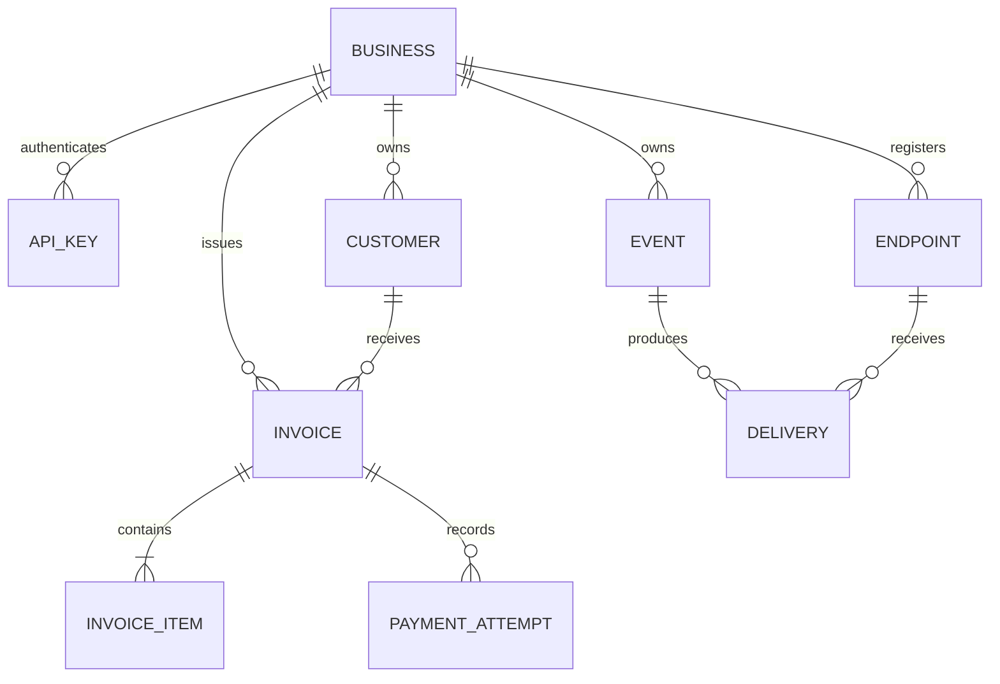
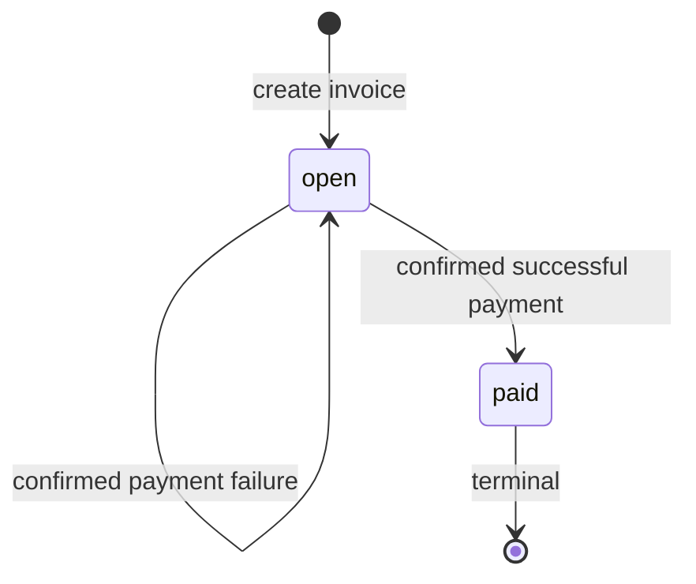

# Invoice and Payment Service Design

Java 21 and Spring Boot were selected because the candidate is confident in Java and new to Rust. The application is a modular monolith: Java interfaces connect modules; HTTP connects the external mock PSP and webhook receivers. PostgreSQL schemas express ownership without splitting atomic business transactions. The optional UI is separate from the required backend submission.

## 1. Data Model

All IDs are UUIDs. Instants use timestamptz; due dates use date. Money is bigint cents and Java long with checked multiplication/addition. Positive totals are capped at 10^12 cents; JSON decimal/string amounts are rejected. Items and totals are immutable after creation. Tenant-composite foreign keys prevent cross-business references. Financial history is not cascade-deleted.

| Table | Shape and indexes | Why; change at 100x |
|---|---|---|
| identity.businesses | ID, name, creation | Explicit tenant; ordinary primary-key lookup remains |
| identity.api_keys | Business, unique prefix, hash, revocation | Multiple rotatable keys; consider bounded auth caching with revocation semantics |
| customers.customers | Business, name, email; business/time/ID index | Email need not be unique; paginate and archive only when measured |
| billing.invoices | Customer, state, total, due date, paid time; business/time and business/state/time indexes | Fixed payable amount; tune queries before sharding |
| billing.invoice_items | Invoice, position, description, quantity, unit cents; unique invoice/position | Ordered normalized items; avoid extra stored line totals |
| payments.payment_attempts | Request fingerprint, replay body, mock token, outcome, lease, retries; unique business/key; partial unique unresolved and succeeded invoice indexes | Durable work and history together; split worker deployment and archive resolved work |
| notifications.webhook_endpoints | Business, immutable URL, encrypted secret; business index | Separate signing identity; add managed rotation |
| notifications.events | Type, source, immutable payload; unique business/type/source and business/time index | Transactional event record; archive and improve reconciliation feed |
| notifications.webhook_deliveries | Event, endpoint, attempts, lease, deadline; unique event/endpoint and partial due index | Independent retries; scale bounded workers and isolate slow destinations |
| mock_psp.operations | Unique caller operation ID, fingerprint, durable result/completion time | Models provider deduplication; separate role/schema, accessed only over HTTP |

A read-only Billing view reports unresolved attempts; it is a deliberate database dependency, not cross-module write access. Extraction would replace it with a suitable read model. Shared PostgreSQL remains a capacity limit: more HTTP services alone do not remove it. Benchmark API traffic, queue age, lock waits and connection pressure before claiming 100x capacity.

## 2. Invoice State Machine

No transition is reversible in this scope. Draft, void and uncollectible workflows are deliberately absent. Attempts separately use pending, unknown, succeeded and failed. An open invoice with an unresolved attempt cannot accept another payment. One eligibility operation supplies API errors and UI hints; POST rechecks under lock. Invalid payment transitions return a descriptive 409.

## 3. Payment Correctness and Failure Modes

Acceptance uses a short READ COMMITTED transaction and SELECT FOR UPDATE on the tenant-scoped invoice. It checks replay before state rejection, inserts pending work and the original 202 response, then commits. Network calls occur outside transactions. TransactionTemplate makes boundaries explicit; module calls share one data source and transaction manager.

**(a) Simultaneous clients.** Different keys serialize on the invoice row: one accepts, others conflict. Same-key identical requests replay. Partial unique indexes reinforce one unresolved attempt and one recorded success. A unique business/key constraint also covers the same key racing across different invoices; after rollback, a fresh lookup compares the fingerprint. Row locks are clearer here than optimistic retry loops; in-memory locks would not coordinate replicas.

**(b) Timeout.** POST returns 202 after persistence. The worker has a five-second HTTP deadline. The mock retains its operation and succeeds after 30 seconds despite caller disconnection. Transport uncertainty becomes unknown, never a decline. GET attempt/invoice and a later webhook expose the confirmed result. Reconciliation delays are 5, 10, 20, 40, 60 and 120 seconds; after six rounds or ten minutes, unresolved work requires review and still blocks a new charge.

**(c) Success followed by crash.** A worker claims persisted work with a 60-second lease and claim version. Recovery queries the same PSP operation ID, equal to the attempt UUID. The mock durably deduplicates that ID and rejects changed parameters. Success finalization atomically updates attempt, invoice and event/deliveries. A stale claim cannot overwrite a newer result. Leases alone do not prevent duplicate external requests. Durable PSP deduplication and lookup are explicit extensions to the supplied mock, not guarantees inferred from HTTP. Without them, automatic no-double-charge recovery cannot be promised.

**(d) Changed body.** The fingerprint includes operation, invoice and validated token. Reusing an accepted key with different parameters returns 409. Rejected validation does not reserve keys. Accepted records do not expire in this exercise.

**(e) Already paid.** Original accepted key/body replays its initial 202; another key receives invoice_already_paid without a PSP call. Current outcome is retrieved separately.

The deterministic network-error mock persists processor_error, returns 500, and exposes confirmed failure through lookup. The app never derives financial outcome from the token or the 500 itself. Unavailable lookup preserves unknown. Retry counters are separate from HTTP call counts. SQL failures roll back local finalization.

## 4. Webhook Design

Immutable events and delivery jobs join the business transaction. Workers claim due rows with SKIP LOCKED and leases; HTTP never blocks the API or holds a database transaction. Endpoints visible and active at destination selection receive the event; concurrent registration may begin with the next event, without historical backfill.

HMAC-SHA256 signs timestamp + dot + exact UTF-8 body. Headers carry timestamp, event ID and versioned hex signature; ID also appears inside the signed body. Receivers compare signatures in constant time, require timestamp skew within 300 seconds, and deduplicate event IDs atomically with processing. Each retry is freshly signed. Delivery order is not guaranteed.

Six attempts: immediate, then 5s, 30s, 2m, 10m and 30m after failure. Each HTTP call has a five-second total deadline; redirects are disabled. This is about 43 minutes without scheduling delay, with a one-hour outer deadline. A crash can consume a reserved attempt. Exhausted records remain inspectable. Businesses retrieve events and current invoice state to reconcile; historical timestamp pagination is not a guaranteed no-gap incremental stream. Duplicate delivery is possible, and finite retries cannot guarantee delivery.

Secrets use random 32-byte values, returned once and encrypted with AES-GCM using unique nonces. The master key is outside the database. Local URLs are operator-allowlisted; production needs DNS/egress controls and TLS.

## 5. API Key Model

Keys contain a public random prefix and a 256-bit random secret; only SHA-256 of the high-entropy secret is stored. Constant-time comparison follows indexed prefix lookup. Bearer transmission uses local HTTP only; production requires HTTPS. Operator commands create and revoke keys. Rotation overlaps keys before revocation; in-flight requests may complete. A leaked key affects its business, not other tenants. No plaintext keys or tokens enter application logs. Seeded credentials are explicitly local-only.

## 6. What Was Cut and Why

- Saga framework, broker and Redis: local atomic finalization and PostgreSQL queues suffice.
- Invoice editing, drafts and voiding: unnecessary transitions for the required flow.
- Refunds, partial payments and multi-currency: explicitly outside scope; future work needs new accounting/state rules.
- Production rate limiting: discuss per-business quotas and bounded admission before adding infrastructure.
- Automatic webhook backfill/replay UI: retained events and documented reconciliation suffice initially.

The user-requested UI is optional and removable; it is not presented as a required assignment feature.

## 7. Production Readiness Gap

1. Operational reconciliation and observability: alerts for unknown outcomes/queue age, durable audit history and an operator workflow.
2. Security and traffic controls: managed secrets/rotation, TLS, destination egress enforcement and business-scoped rate limits.
3. Real-provider validation and capacity evidence: contractual idempotency retention, reconciliation guarantees, load measurements and stronger event recovery semantics.

See VERIFICATION.md for evidence and unexecuted Docker-dependent gates. The implementation must not be called production-ready based on unit tests alone.
