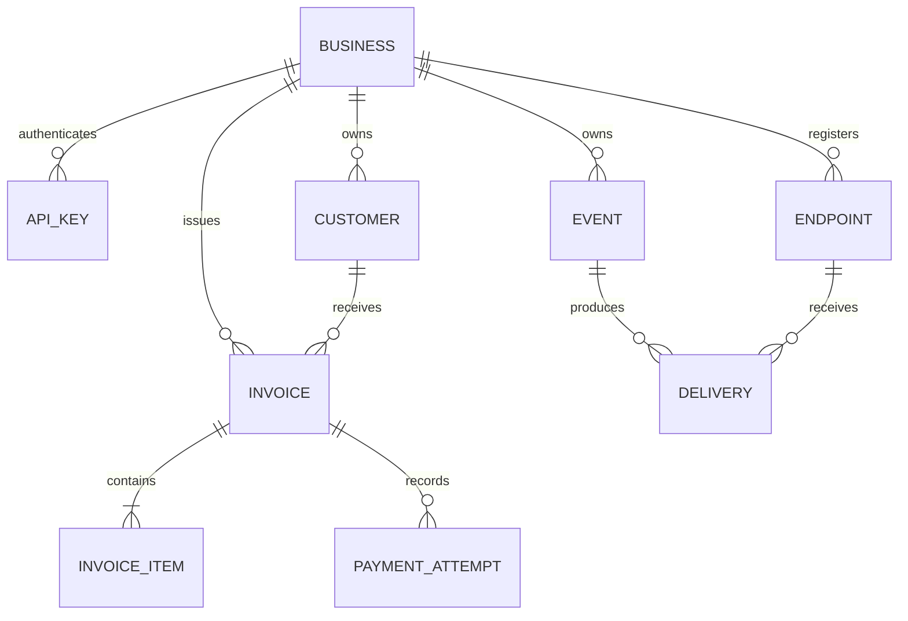
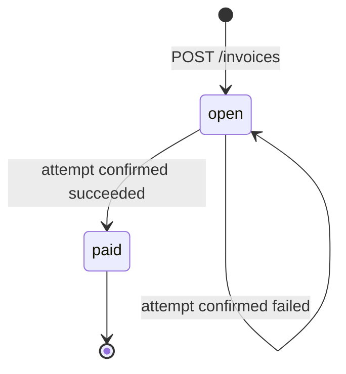

# Invoice and Payment Service — Design

Java 21 / Spring Boot instead of Rust: the author knows Java well enough to own and explain it; the brief permits this with justification.

## 0. Architecture and request flow

- **app** — a modular monolith. Packages `identity`, `customers`, `billing`, `payments`, `notifications` each own one PostgreSQL schema, use Spring Data JPA repositories (QueryDSL for claims), and call each other through Java interfaces, never HTTP.
- **mock-psp** — a separate process with its own schema and database role; the app reaches it only over HTTP.
- **demo-receiver** — a Java signature-verifying webhook receiver. The optional `ui` frontend is out-of-scope, removable.

Flow: `POST /pay` → short transaction (lock invoice, insert `pending` attempt) → worker claims the attempt → PSP call **outside** any transaction → one transaction updates attempt, invoice, event and delivery rows → webhook worker signs and POSTs.

Why not HTTP between modules: invoice state, attempt outcome and webhook event must commit together. In one process that is one local transaction; across services it becomes a saga with new partial-failure states and no benefit at this size. The only distributed boundary is the PSP, handled by durable attempts and reconciliation. Replicas scale horizontally because coordination lives in PostgreSQL (row locks, unique constraints, `SKIP LOCKED`), not memory. Extract services only when measured.

## 1. Data Model

Primary keys default to PostgreSQL 18 `uuidv7()`: time-ordered, index-local; access relies on tenant scoping, not secrecy. Liquibase XML keeps one changelog per table. Money is `bigint` cents / Java `long` with `Math.multiplyExact/addExact`; JSON decimals and numeric strings are rejected; only the server computes totals (max 10^12 cents). Tenant-composite foreign keys `(business_id, id)` block cross-business references. No cascading deletes of financial history.

| Table | Shape / indexes | Why; at 100× |
|---|---|---|
| identity.api_keys | unique prefix, SHA-256 hash, revoked_at | Several keys per business for rotation; add a short-TTL auth cache |
| customers.customers | business, name, email; (business, created, id) | Cursor pagination; email intentionally not unique |
| billing.invoices | state, total, due date, paid_at; (business, created) and (business, state, created) | Immutable amount once issued; CHECK ties `paid` to `paid_at` |
| billing.invoice_items | position, quantity, unit cents | Normalised; line totals not stored |
| payments.payment_attempts | key, fingerprint, token, status, lease, claim_version, retry counters; unique (business, key); partial unique "one unresolved" and "one succeeded" per invoice; partial due index | Durable work queue and history in one row; partition by time and archive resolved rows |
| notifications.events | type, source, invoice, data; unique (business, type, source) | Written in the business transaction; dedupes repeated finalisation |
| notifications.webhook_deliveries | attempts, lease, deadline; unique (event, endpoint); partial due index | Independent retries per endpoint |
| mock_psp.operations | caller operation ID (PK), fingerprint, result, completion time | Models provider-side deduplication |

Billing learns about unresolved payments through a Java interface the payments module implements, never by reading another schema.

## 2. State Machines

`open` is initial; `paid` is terminal and irreversible. Outcome uncertainty lives on the attempt:

```mermaid
stateDiagram-v2
 [*] --> pending: POST /pay accepted (202)
 pending --> succeeded: PSP confirms
 pending --> failed: PSP declines
 pending --> unknown: timeout, 5xx, connection error
 unknown --> succeeded: lookup confirms
 unknown --> failed: lookup confirms
 unknown --> unknown: still pending; retry 5–120 s, then review_required
 succeeded --> [*]
 failed --> [*]
```

Invalid transitions are rejected under the invoice row lock: paying a paid invoice → `409 invoice_already_paid`; paying while an attempt is pending/unknown → `409 payment_in_progress`. `markPaid` is `UPDATE … WHERE state='open'`, and a CHECK constraint bounds the states. Draft, void and uncollectible were cut: nothing required triggers them.

## 3. Payment Correctness & Failure Modes

Mechanism: **row-level lock** (`SELECT … FOR UPDATE` on the invoice) plus **unique constraints** and **status-conditional updates with a claim version**. In-memory locks do not coordinate replicas; advisory locks add a second lock namespace; optimistic or SERIALIZABLE retries push retry loops onto callers for a rarely contended row.

**(a) Concurrent requests.** Different keys serialise on the invoice row: one inserts a `pending` attempt and returns 202; the rest see it and get 409. The partial unique index "one unresolved attempt per invoice" backs this up. The same key racing on two invoices hits the unique (business, key) constraint; the loser rolls back, re-reads and gets `idempotency_key_conflict`. Tested with 20 concurrent clients: one 202, one PSP call.

**(b) PSP timeout.** The endpoint already returned 202 in milliseconds. The worker's PSP call has a 5-second deadline; on timeout the attempt becomes `unknown` (never `failed`); the invoice stays `open` but blocked. Reconciliation GETs the same operation after 5, 10, 20, 40, 60, 120 s; the mock completes at 30 s, so the attempt becomes `succeeded`, the invoice `paid`, and `invoice.paid` is sent. Callers poll the attempt or await the webhook. After six rounds or ten minutes it stays `unknown` with `review_required`, still blocking another charge.

**(c) Success, then crash before persisting.** The attempt was committed before the call, with a 60-second lease. After expiry another worker reclaims it (claim_version increments, so a stale worker's late write is ignored) and **looks up the same operation ID** (the attempt UUID). The PSP returns the original success; no new charge. If the PSP never saw it (404), the identical operation is re-POSTed and deduplicated by ID. This relies on the mock's durable deduplication and lookup, an explicit extension mirroring real providers' idempotency keys.

**(d) Same key, different body.** The stored fingerprint covers invoice and token; a mismatch returns `409 idempotency_key_conflict`. Only accepted requests reserve keys.

**(e) Paid invoice, another POST.** Same key and body: the original 202 is replayed (no PSP call). New key: `409 invoice_already_paid`.

`tok_network_error` returns 500; the app treats it as `unknown` until lookup confirms `failed/processor_error`; the invoice stays open and payable with a new key.

## 4. Webhook Design

Events and delivery rows are written in the state change's transaction (transactional outbox), so a committed payment cannot lose its notification. Workers claim due rows with `SKIP LOCKED` and a 30-second lease; HTTP never runs inside a transaction or on the request path.

Signing: HMAC-SHA256 over `timestamp + "." + exact body bytes`, sent as `X-Webhook-Signature: v1=<hex>`, with `X-Webhook-Timestamp` and `X-Webhook-Id` (the event ID, also inside the signed body). Receivers compare in constant time, reject timestamps more than 300 s old (replay protection) and deduplicate on event ID. Each retry is freshly signed.

Retries: six attempts — immediately, then 5 s, 30 s, 2 min, 10 min, 30 min after each failure (about 43 min), 5-second timeout per attempt, no redirects, one-hour hard deadline. Exhausted deliveries stay visible; businesses reconcile via `GET /events` and invoice state. Delivery is at-least-once and unordered.

Secrets are 32 random bytes, returned once, AES-GCM-encrypted at rest with a key outside the database. Registration is limited to the configured receiver URL (no general SSRF defence yet).

## 5. API Key Model

Format `prefix.secret` with a 256-bit random secret. Only its SHA-256 is stored (fast hashing suffices for high-entropy secrets); lookup by indexed prefix, constant-time comparison. Bearer header only; production needs TLS. An operator CLI creates and revokes keys; rotation = create second key, switch clients, revoke the first. Revocation applies to the next request. A leaked key exposes one business. Keys never appear in logs.

## 6. What Was Cut and Why

- Draft/void/uncollectible invoices: no required trigger; `void` is the natural next addition.
- Refunds and partial payments: need ledger-style accounting, not a status flag.
- Broker, Redis, sagas: PostgreSQL queues and local transactions suffice.
- Production rate limiting: per-business token buckets at the gateway, discussed not built.
- Webhook replay UI and secret rotation.

The optional UI (built on request) holds no business rules.

## 7. Production Readiness Gap

1. Observability: UUIDv7 trace IDs link logs across services. Missing: trace export, alerts on queue age, `unknown` attempts, exhausted deliveries; audited review handling.
2. Security: TLS, managed secrets, egress-controlled webhook URLs, per-business rate limits.
3. A real PSP contract (idempotency retention, lookup, settlement reconciliation) and load-tested capacity.

## 8. Scaling to 100× (plan, not measured)

No load test has been run.

1. Measure acceptance p99, queue age, lock waits, pool saturation.
2. Stateless API replicas; workers deployed separately (same image, `WORKERS_ENABLED`) and sized independently.
3. PgBouncer, read replicas for lists/events, time-partitioning or archiving of attempts, events and deliveries.
4. Locks are per invoice, so contention does not grow with tenants; tenant data is keyed by `business_id`, enabling sharding by business.
5. If polling latency matters, wake workers via LISTEN/NOTIFY or a broker (outbox stays authoritative); cap per-endpoint webhook concurrency.
